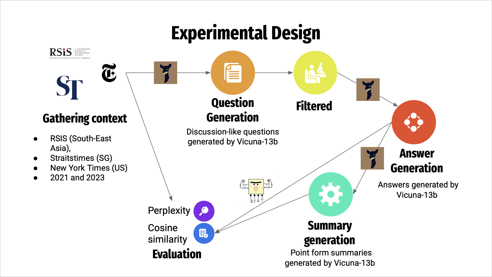
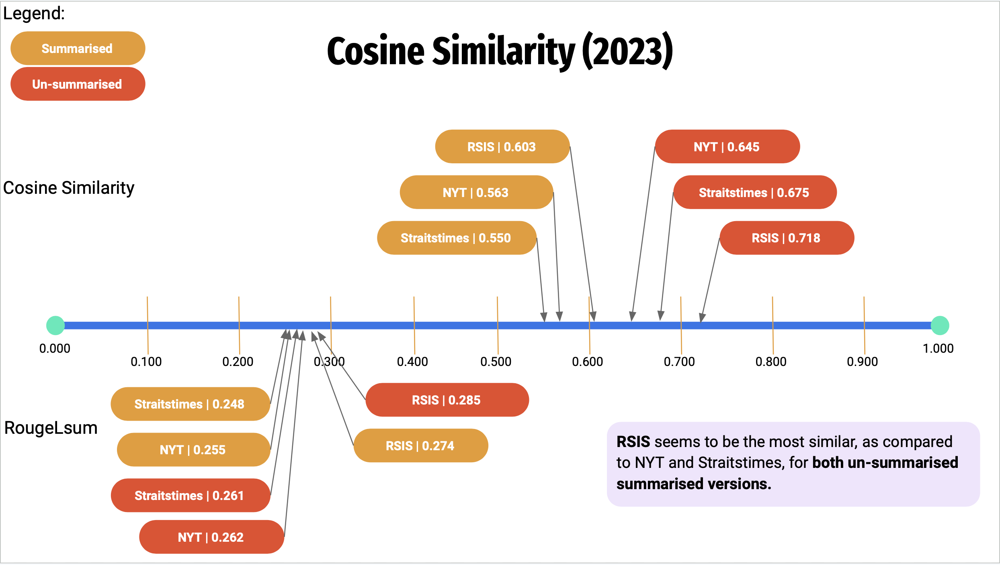
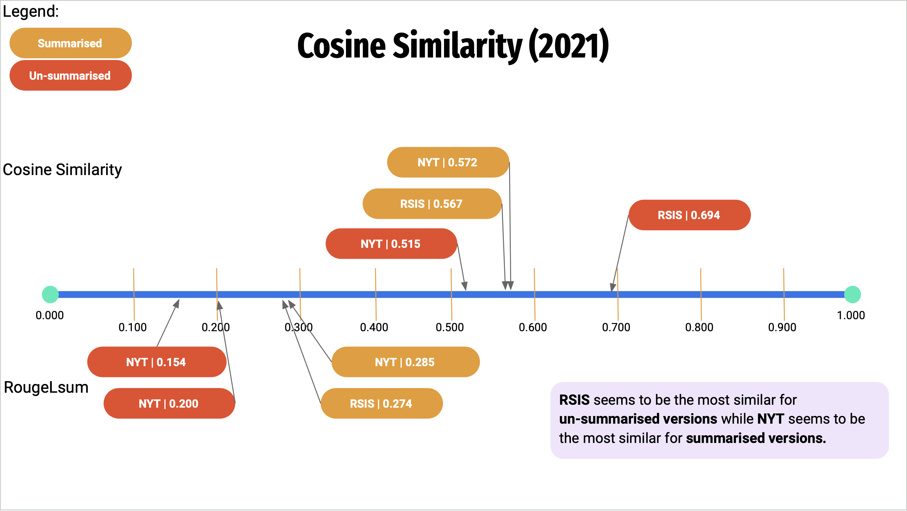
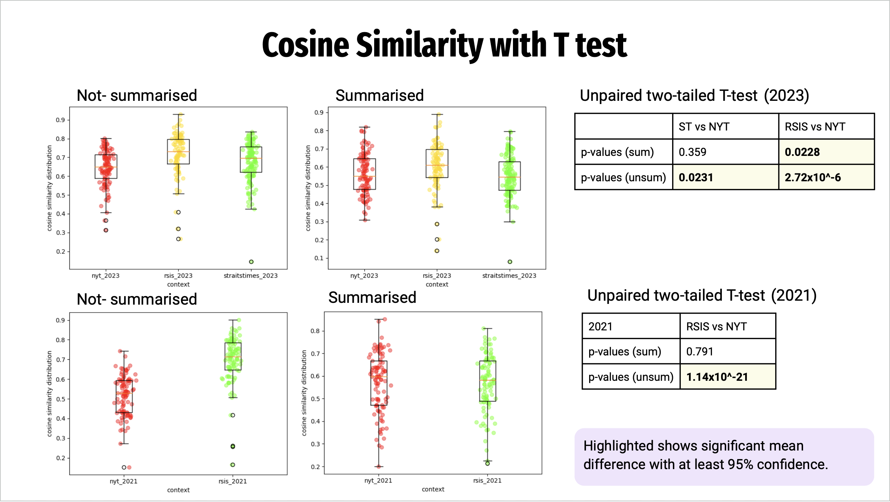
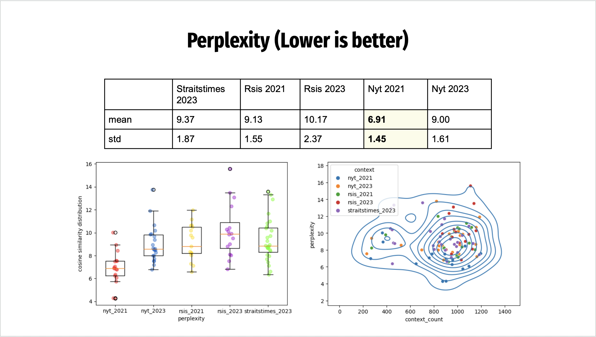

# Complex Question Answering with Large Language models
This project aims to investigate biases within large language models by generating questions from articles of different context and evaluating the model's long-form responses to the source articles (Ground truth).
This README provides instructions on how to use the Question-Answering pipeline and how to replicate results.

## Experimental Design


## Environment setup
### Method 1: Using conda (recommended):
Recreate the environment using:
```bash
$ conda env create -f environment.yml
```
For more information: https://conda.io/projects/conda/en/latest/user-guide/tasks/manage-environments.html#creating-an-environment-from-an-environment-yml-file

### Method 2: Using pip:
```bash
$ pip install -r requirements.txt
```
*Note that with pip, there might be package conflicts*

## Dataset
The data used and generated from this project can be found under the `./data` directory. This includes data that has been scrapped off the internet, from the S.Rajaratnam School of International Studies (RSIS), Straitstimes (ST) and New York Times (NYT), representing the South East Asian context, Singaporean context and New York Times context respectively. For more information, please refer to `./data`.

Web scraping scripts for RSIS, Straitstimes and NYT are also provided under `./web-scrapping` for more data gathering.

## Setting up FastChat Server
Before executing the QA generation scripts, be sure to run the FastChat API server if you are not using openai's model. To clone the FastChat repo, please refer to: https://github.com/lm-sys/FastChat/tree/main#install

The FastChat server can be hosted with these commands:
#### Fastchat directory
```bash
$ cd Fastchat
```
#### Controller
```bash
$ python3 -m fastchat.serve.controller --port [controller_port_number]
```
#### Model worker
```bash
$ python3 -m fastchat.serve.model_worker --model-name [model_name] --model-path [model_path] --gpus 0,3 --num-gpus 2 --max-gpu-memory 80Gib --port [worker_port_number] --worker-address http://localhost:[worker_port_number] --controller-address http://localhost:[controller_port_number]
```
#### Restful API server 
```bash
$ python3 -m fastchat.serve.openai_api_server --host localhost --port [restful_port_number] --controller-address http://localhost:[controller_port_number]
```
For more information about the FastChat restful API server, please refer to the FastChat repo: https://github.com/lm-sys/FastChat/blob/main/docs/openai_api.md

## Question-Answering Pipeline
This is the pipeline for Question generation, Answer generation and evaluations using cosine similarity and perplexity. More information on the file structure can be found in `./QA-generation`.

### QA configs
Please configure the model parameters in the QA configs before beginning. This is an example configuration
```yaml
vicuna-13b-v1.3:
  openai_localhost: http://localhost:[restful_port_number]/v1
  openai_api_key: EMPTY
  openai_organization: [openai-organisation]
```

### Definitions
Definitions for the model can be fed through the `./configs/definitions_config.json` file. Here default definitions are already given for
* Question Generation
* Answer Generation
* Summarise to points
* Text summarisation
* Answer Generation with Context

### Question Generation
```bash
$ python3 question-generation.py 
    --context_name rsis \
    --num_of_generations 1 \
    --model_name vicuna-13b-v1.3 \
    --qa_config_path ./configs/QA_config.yaml \
```

### Answer Generation
Use this command for answer generation without context (Close book QA). Evaluations will be calculated automatically upon answer generation:
```bash
$ python3 close-book-generation.py \
    --context_name rsis \
    --questions_path ../data/generations/rsis/questions_rsis_vicuna-13b-v1.3.json \
    --num_of_generations 1 \
    --model_name vicuna-13b-v1.3 \
    --qa_config ../configs/QA_config.yaml \
```

For answer generation with context (open book QA), use this command:
```bash
$ python3 open-book-generation.py \
    --context_name rsis \
    --questions_path ../data/generations/rsis/questions_rsis_vicuna-13b-v1.3.json \
    --num_of_generations 1 \
    --model_name vicuna-13b-v1.3 \
    --qa_config ./configs/QA_config.yaml \
    --starting_dataset_path ../data/generations/rsis/open_book_answers_rsis_vicuna-13b-v1.3.json \
```

## Perplexity
Calculating perplexity is a separate process, ensure that `perplexity_filepath.yml` is configured before running `perplexity.py`.

```bash
$ python3 perplexity.py --perplexity_config ../configs/perplexity_filepath.yml
``` 

As we are using the HuggingFaceAPI for calculating perplexity, cuda's device map can be configured in `./configs/device_map.json`. Change the code to use the configured device map in `./QA-generation/perplexity.py`.

## Misc
### Data cleaning
Data cleaning scripts can be found under `./data-cleaning`.

### Calculating Evaluations
Scripts and notebooks to calculate evaluations can be found under `./more-eval`

# Findings
Here are the cosine similarity calculations between the generated answers and the source (ground truth).

## Cosine similarity 2023


## Cosine similarity 2021

## T-test for cosine similarity
We also conducted an unpaired 2-tailed t-test to verify the differences in mean.



## Perplexity
We also calculated perplexity as shown:



# Citations
The architecture for this project was inspired by the self_instruct framework, used in Standford's Alpaca.
```BibTex
@misc{wang2023selfinstruct,
      title={Self-Instruct: Aligning Language Models with Self-Generated Instructions}, 
      author={Yizhong Wang and Yeganeh Kordi and Swaroop Mishra and Alisa Liu and Noah A. Smith and Daniel Khashabi and Hannaneh Hajishirzi},
      year={2023},
      eprint={2212.10560},
      archivePrefix={arXiv},
      primaryClass={cs.CL}
}
```

This repo also used FastChat extensively, which was mainly developed with reference to the paper below:
```BibTex
@misc{zheng2023judging,
      title={Judging LLM-as-a-judge with MT-Bench and Chatbot Arena},
      author={Lianmin Zheng and Wei-Lin Chiang and Ying Sheng and Siyuan Zhuang and Zhanghao Wu and Yonghao Zhuang and Zi Lin and Zhuohan Li and Dacheng Li and Eric. P Xing and Hao Zhang and Joseph E. Gonzalez and Ion Stoica},
      year={2023},
      eprint={2306.05685},
      archivePrefix={arXiv},
      primaryClass={cs.CL}
}
```

